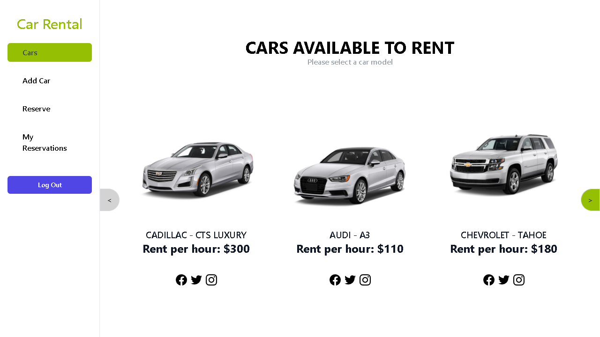

# Rent Car Front-End

> Car Rental Frontend Application that lets the user rent cars on a given date. Interacts with RoR Backend application.

## Preview


## Live Demos

- Link to BackEnd API Server [Here](https://final-capstone-project-lfmn.herokuapp.com/api/cars)
- Link to the Website [Try it Here](https://car-rental-frontend-lfmn.netlify.app/)

## Built With

* [NodeJS](https://nodejs.org/en/)
* [ReactJS](https://reactjs.org/)
* [React Redux](https://react-redux.js.org/)
* [Tailwind CSS](https://tailwindcss.com/)

## Getting Started

- To get a local copy of the repository please run the following commands on your terminal:
   ```
   git clone https://github.com/lfmnovaes/car-rental-front-end
   ```
- Go to the cloned directory with `cd car-rental-front-end`
- Run `npm install` to install all the necessary packages
- After installing everything, you can run now the website with `npm start`

## Running linters locally
   
- Eslint (JavaScript code linter), run: `npx eslint .`

- StyleLint (CSS code linter), run: `npx stylelint "**/*.{css,scss}"`

## Authors

👤 **Luís Fernando**

- GitHub: [](https://github.com/lfmnovaes)
- Twitter: [](https://www.twitter.com/lfmnovaes/)
- LinkedIn: [](https://www.linkedin.com/in/lfmnovaes/)

👤 **Ramiro Aquistapace**

- GitHub: [@ramiaquista](https://github.com/ramiaquista)
- Twitter: [@ramiaq1](https://twitter.com/ramiaq1)
- LinkedIn: [RamiroAquistapace](https://www.linkedin.com/in/ramiro-aquistapace-32b61b204/)

👤 **Enmanuel Lassis**

- [GitHub](https://github.com/elassis)
- [LinkedIn](https://linkedin.com/in/enmanuel-lassis-peña)

## Kanban board

- Link to the kanban board: [Kanban-Board](https://github.com/lfmnovaes/car-rental-back-end/projects/1)

- Link to the kanban board image: [Kanban-Image](https://user-images.githubusercontent.com/61469201/154359272-8ebc368b-dcb9-403c-93df-e5a7b50b8ba7.png)

- Number of Team Members: 3

## 🤝 Contributing

Contributions, issues, and feature requests are welcome!

Feel free to check the [issues page](../../issues/).

## Show your support

Give a ⭐️ if you like this project!

## Acknowledgments

- Microverse

## 📝 License

This project is [MIT](./LICENSE) licensed.
